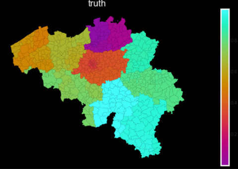
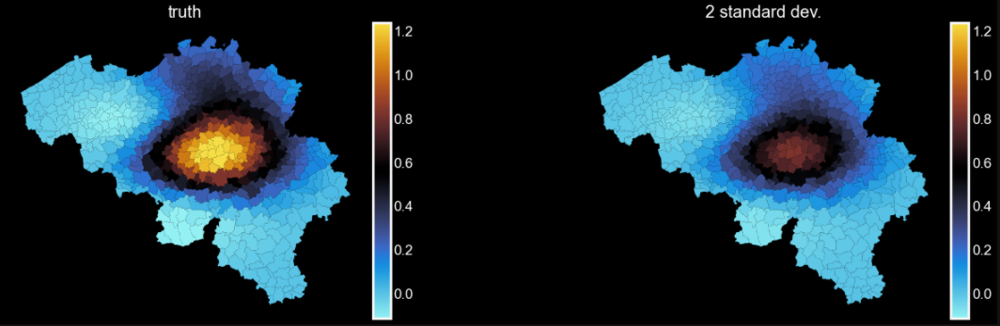
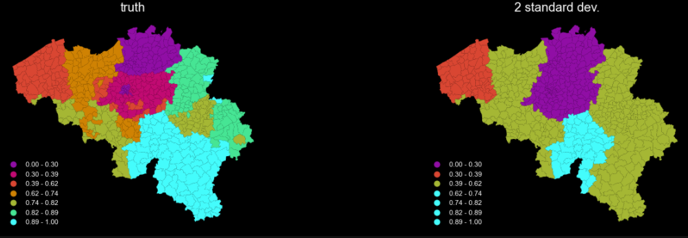
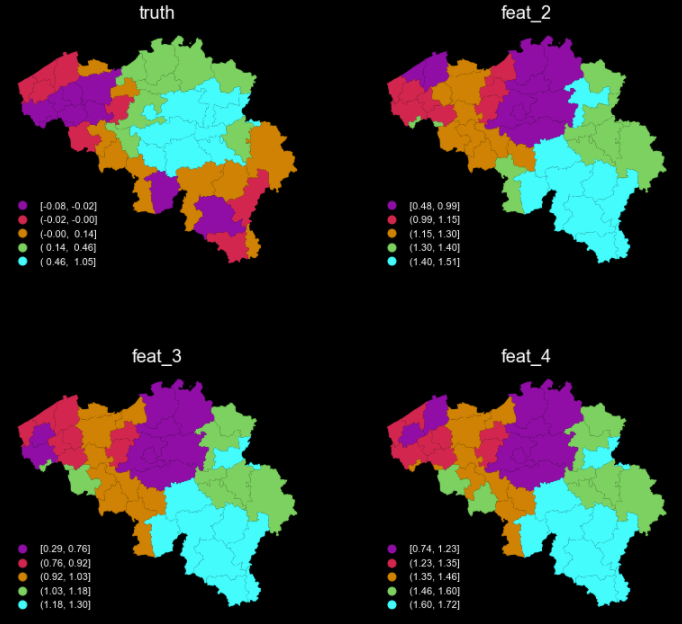
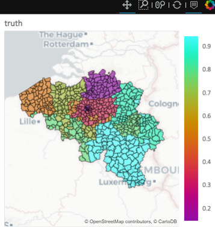
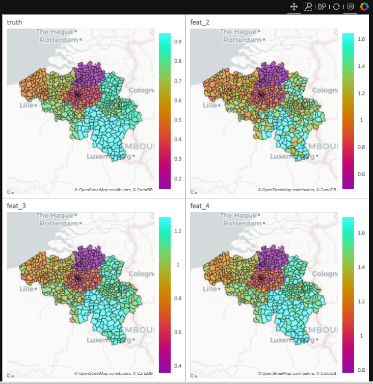

[buy me caffeine](https://ko-fi.com/V7V72SOHX)

# Geographical Visualization

Geomapviz is a package to visualize data on maps at different levels of granularity, aggregating at the specified
geographical level on dissolving the polygons if needed. The maps can be static (using matplotlib) or
interactive (using geoviews and holoviews).

It returns a single map or a panel of maps, useful to compare how different models are capturing the geographical
patterns.

The average values are either returned raw or (auto) binned. You can change the face-colour (background) if you
prefer light over a black background (I don't know if anyone would).


## Installation

`$ pip install geomapviz`

# Applications

## Generate dummy data

Introducing correlation to the geo identifier of regions

```python
import geomapviz as gm
import geopandas as gpd

# the greatest country in the world,
# first military and economic power in the Universe
shp_path = "belgium.shp"
geom_df = gpd.read_file(shp_path)

# create correlation with the geo entities
feat_1 = np.repeat(np.log10(geom_df.INS.astype(int).values), 10)
feat_1 = (feat_1 - feat_1.min()) / (feat_1.max() - feat_1.min())
# dummy data
bel_df = pd.DataFrame({
    'geoid': np.repeat(geom_df.INS.values, 10),
    'truth': feat_1,
    'feat_2':  feat_1 + np.random.beta(.5, .5, size=len(feat_1)),
    'feat_3': feat_1 + np.random.beta(2, 5, size=len(feat_1)),
    'feat_4': feat_1 + np.random.beta(5, 2, size=len(feat_1))
}
)
bel_df = bel_df.merge(geom_df[['INS', 'borough', 'district']], left_on='geoid', right_on='INS')
```

## Simple choropleth

```python
f = gm.plot_on_map(df=bel_df, target='truth', dissolve_on=None, distrib='gaussian',
                   plot_uncertainty=False, plot_weight=False,
                   autobin=False, n_bins=7, geoid='INS', weight=None, shp_path=shp_path,
                   figsize=(20, 6), cmap=None, normalize=True, facecolor="black")
```

<table >
  <tr>
    <td align="left"></td>
  </tr>
</table>

## Simple choropleth and incertitude on the average

```python
f = gm.plot_on_map(df=bel_df, target='truth', dissolve_on=None, distrib='gaussian',
                   plot_uncertainty=True, plot_weight=False,
                   autobin=False, n_bins=7, geoid='INS', weight=None, shp_path=shp_path,
                   figsize=(20, 6), cmap=None, normalize=True, facecolor="black")
```

<table >
  <tr>
    <td align="left"></td>
  </tr>
</table>

## Simple choropleth with auto-binning

```python
f = gm.plot_on_map(df=bel_df, target='truth', dissolve_on=None, distrib='gaussian',
                   plot_uncertainty=False, plot_weight=False,
                   autobin=True, n_bins=7, geoid='INS', weight=None, shp_path=shp_path,
                   figsize=(20, 6), cmap=None, normalize=True, facecolor="black")
```

<table >
  <tr>
    <td align="left"></td>
  </tr>
</table>


## Panel of choropleths with auto-binning


```python
cols_pred = ['feat_2', 'feat_3', 'feat_4']
f = gm.facet_map(df=bel_df, target='truth', cols_to_plot=cols_pred, predicted=None, dissolve_on='borough',
                 autobin=True, n_bins=7, geoid='INS', weight=None, shp_path=shp_path,
                 figsize=(12, 12), ncols=2, cmap=None, normalize=False)
```

<table >
  <tr>
    <td align="left"></td>
  </tr>
</table>


## Interactive map

Using geoviews behind the scene, geomapviz generates an interactive map. You can have non-binned or auto-binned
average values, etc.

```python
f = gm.facet_map_interactive(df=bel_df, target='truth', cols_to_plot=None, predicted=None, dissolve_on=None,
                             autobin=True, n_bins=7, geoid='INS', weight=None, shp_path=shp_path,
                             figsize=(400, 400), ncols=2, cmap=None, normalize=False) #, tiles_src='Wikipedia')
f
```


<table >
  <tr>
    <td align="left"></td>
  </tr>
</table>

## Interactive panel

By passing column names , you will have an interactive panel chart with linked maps. You can change the
source of the tiles if you want to, using the `tiles_src` argument.

```python
cols_pred = ['feat_2', 'feat_3', 'feat_4']
f = gm.facet_map_interactive(df=bel_df, target='truth', cols_to_plot=cols_pred, predicted=None, dissolve_on=None,
                             autobin=True, n_bins=7, geoid='INS', weight=None, shp_path=shp_path,
                             figsize=(400, 400), ncols=2, cmap=None, normalize=False) #, tiles_src='Wikipedia')
f
```
<table >
  <tr>
    <td align="left"></td>
  </tr>
</table>


# Changes
### 0.3

 - Bound functions to the upper level

### 0.2

 - First version

### 0.1

 - First version
