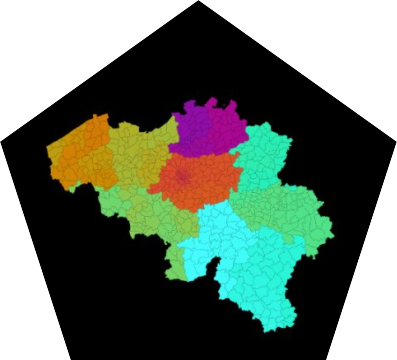
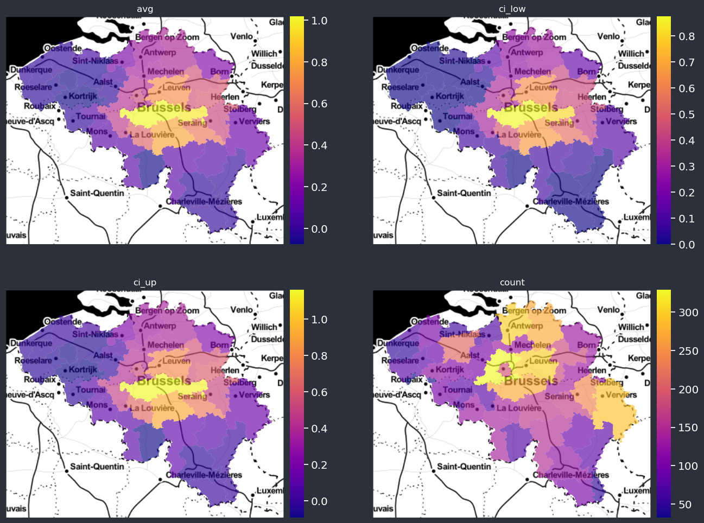
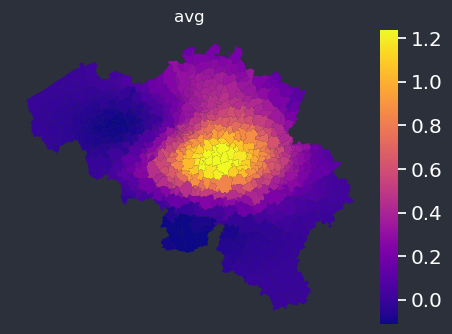

[buy me caffeine](https://ko-fi.com/V7V72SOHX)

# 🗺️🐍 Geomapviz - Python Library for Beautiful and Interactive Geospatial Tabular Data Visualization 🚀

Geomapviz is a Python library for visualizing geospatial tabular data. It aggregates tabular data at the geoid level, merges it with the shapefile, and provides a simple API to plot the average for single or multiple columns. The library is designed to create beautiful and interactive visualizations that help users better understand geospatial data. Geomapviz can produce a single map or a panel of maps, making it useful for comparing how different models capture geographical patterns. The package also supports returning average values either raw or automatically binned. Additionally, it allows users to customize the background color, including the option to switch from a black background to a light one. The styling is handled by a DataClass, PlotOptions, object is used to specify various arguments for creating a geospatial plot of a dataset

[Geomapviz ReadTheDocs](https://geomapviz.readthedocs.io/en/latest/)

<td align="left"></td>
<td align="left"></td>

## Installation

`$ conda install -c conda-forge cartopy` then
`$ pip install geomapviz -U`

 - If you face a `cartopy` installation error, try to install first from pre-built binaries `conda install -c conda-forge cartopy`. For installing on Linux platform, some dependencies are required, see [the cartopy documentation](https://scitools.org.uk/cartopy/docs/latest/installing.html) for details.
 - If you face a geoviews installation error, try `conda install -c pyviz geoviews`

## Documentation

The [documentation notebook](nb/docs/geomap.ipynb) illustrates the functionality of `geomapviz`
## Changelog

### 1.0

 - Complete refactoring of the library, including modular features and simpler code base

### 0.6

 - Including files in source distributions

### 0.5

 - [Bug] Capital letter in importing the BE shapefile
 - [Bug] Changed default values of arguments

### 0.4

 - Make Belgian shp available using load_be_shp
 - More decimal
 - User defined alpha for the interactive maps

### 0.3

 - Bound functions to the upper level

### 0.2

 - First version

### 0.1

 - First version
