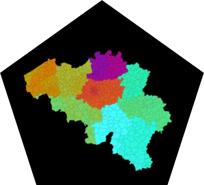
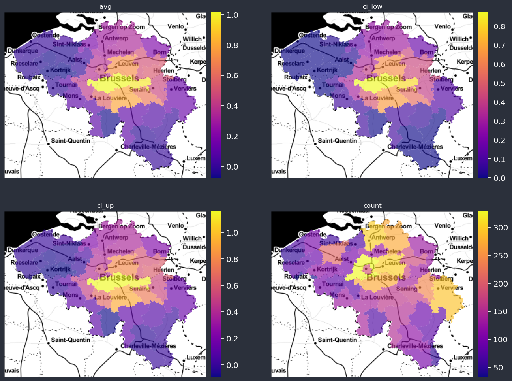
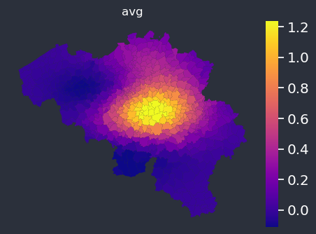

[buy me caffeine](https://ko-fi.com/V7V72SOHX)

[](https://github.com/psf/black)
[](https://pypi.org/project/geomapviz/)

# 🗺️🐍 Geomapviz - Python Library for Beautiful and Interactive Geospatial Tabular Data Visualization 🚀

Geomapviz is a Python library for visualizing geospatial tabular data. It aggregates tabular data at the geoid level, merges it with the shapefile, and provides a simple API to plot the average for single or multiple columns. The library is designed to create beautiful and interactive visualizations that help users better understand geospatial data. Geomapviz can produce a single map or a panel of maps, making it useful for comparing how different models capture geographical patterns. The package also supports returning average values either raw or automatically binned. Additionally, it allows users to customize the background color, including the option to switch from a black background to a light one. The styling is handled by a DataClass, PlotOptions, object is used to specify various arguments for creating a geospatial plot of a dataset

[Geomapviz ReadTheDocs](https://geomapviz.readthedocs.io/en/latest/)

<td align="left"></td>
<td align="left"></td>


## Installation

The 2.0 development checkout requires Python 3.12 or newer. Install the base
package for aggregation, geography preparation and static maps:

```sh
pip install .
```

For interactive maps and HTML export:

```sh
pip install '.[interactive]'
```

Country boundaries, raster backgrounds and sample data are no longer bundled.
Supply your own boundaries with `geopandas.read_file`, then use
`aggregate_means` or `aggregate_rates`, `prepare_geography`, and
`geomapviz.plot.plot_geography`. The obsolete `load_shp`, `load_geometry`,
`merge_zip_df` and `convert_category_to_code` helpers have been removed.
The hosted documentation below still describes the 1.x API.

## Migrating to 2.0

2.0 is a breaking release; the checkout remains at `2.0.0.dev0` until release
delivery. Python 3.12 is the minimum. Dependency bounds reflect the tested
stacks recorded in [MILESTONES.md](MILESTONES.md).

| Removed 1.x behavior | 2.0 replacement |
| --- | --- |
| `prepare_dataframe`, weighted-average helpers and renamed `target` metrics | `aggregate_means` preserves metric names and returns a DataFrame |
| Implicit weighting and confidence intervals | `aggregate_rates` distinguishes observed totals/rates; predictions are rates; intervals are removed |
| Country loaders, sample bundles and CSV/category helpers | Read caller-supplied boundaries with GeoPandas; preserve geographic labels |
| `spatial_average_plot`, `spatial_average_facetplot` and data-bearing `PlotOptions` | Prepare with `prepare_geography`, then render with `plot_geography` |
| Record-supplied parent mapping and averages of area averages | `assign_parent`, aggregate original records, and dissolve boundaries explicitly |
| Tiles, raster backgrounds, normalization and uncertainty options | Shared scales, missing-area styling and explicit support panels |
| Interactive stack in every installation | Install the `interactive` extra when needed |

Select a common finite cohort before aggregation. Missing metrics, invalid
weights, zero-support areas and unknown/ambiguous boundary IDs fail explicitly.
Boundaries without observations remain present with missing metrics. Preserve
summary `attrs` for support names and quantity-specific scales; CSV does not
retain this metadata. There are no compatibility shims.

The synthetic [prepared comparison](examples/prepared_comparison.py) runs
statically by default; add `--interactive` to also export HTML. Source archives
include the examples needed to rerun the tests. The
[installation check](examples/verify_install.py) must run with an installed
artifact's Python from a copied examples directory outside the checkout:

```sh
/tmp/geomapviz-check/bin/python examples/verify_install.py --output /tmp/geomapviz-check-exports
```

For an environment installed with the interactive extra, add `--interactive`.

## Documentation

The [documentation notebook](nb/docs/geomap.ipynb) illustrates the functionality of `geomapviz`
## Changelog

### 1.0

 - Complete refactoring of the library, including modular features and simpler code base

### 0.6

 - Including files in source distributions

### 0.5

 - [Bug] Capital letter in importing the BE shapefile
 - [Bug] Changed default values of arguments

### 0.4

 - Make Belgian shp available using load_be_shp
 - More decimal
 - User defined alpha for the interactive maps

### 0.3

 - Bound functions to the upper level

### 0.2

 - First version

### 0.1

 - First version
