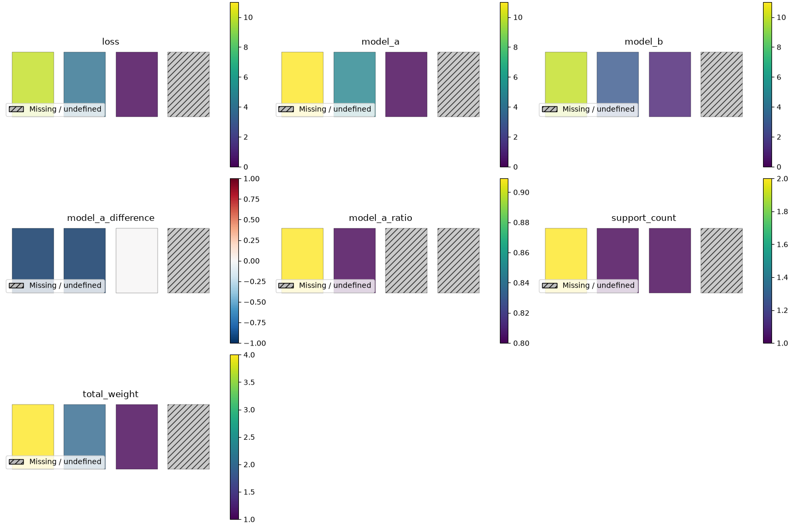

# Arithmetic reference

Rectangles make small calculations easy to check. For recognizable maps, start
with the [Belgian rates tutorial](examples/rates.md).

## A complete synthetic comparison

This is the same data and workflow as
[the prepared-comparison example](https://github.com/ThomasBury/geomapviz/blob/v2.0.0/examples/prepared_comparison.py).
The four rectangles are invented boundaries, not an administrative map.
`loss` contains observed amounts; both model columns contain predicted amounts
per unit of exposure. Exposure measures the time or quantity at risk, such as
insured years. With loss in euros and exposure in insured years, the resulting
rates are euros per insured year. The zero-exposure row has no contribution.

`area` is the geographic ID that joins records to boundaries; keep its leading
zeros. `EPSG:4326` identifies the boundary coordinate reference system (CRS):
the rectangles use longitude and latitude in degrees.

```python
import geopandas as gpd
import matplotlib.pyplot as plt
import pandas as pd
from shapely.geometry import box

from geomapviz import aggregate_rates, prepare_geography
from geomapviz.plot import PlotOptions, plot_geography

records = pd.DataFrame({
    "area": pd.Categorical(["001", "001", "002", "002", "003"]),
    "loss": [10.0, 30.0, 8.0, 999.0, 0.0],
    "exposure": [1.0, 3.0, 2.0, 0.0, 1.0],
    "model_a": [8.0, 12.0, 5.0, 999.0, 0.0],
    "model_b": [10.0, 10.0, 3.0, 999.0, 1.0],
})
boundaries = gpd.GeoDataFrame(
    {"area": ["001", "002", "003", "004"]},
    geometry=[box(4 + i * 0.1, 50, 4.08 + i * 0.1, 50.08) for i in range(4)],
    crs="EPSG:4326",
)
summary = aggregate_rates(
    records, "area", "loss", ["model_a", "model_b"], "exposure"
)
mapped = prepare_geography(summary, boundaries, "area")
metrics = ["loss", "model_a", "model_b", "model_a_difference", "model_a_ratio"]
figure = plot_geography(
    mapped, metrics, geoid="area", include_support=True,
    options=PlotOptions(ncols=3, figsize=(15, 10), alpha=0.8),
)
figure.savefig("comparison.png")
plt.close(figure)
print(summary)
print(mapped.attrs["coverage"])
```

Save the code as `arithmetic.py` and run:

```sh
uv run --no-project --python 3.12 --with 'geomapviz==2.0.0' arithmetic.py
```

Open `comparison.png` in an image viewer and inspect the printed summary and
coverage. This compact example checks the arithmetic behind the geographic tutorials.

Area `001` has observed rate `40 / 4 = 10` and model A rate
`(8 × 1 + 12 × 3) / 4 = 11`. Its signed difference is `-1` and ratio is
`40 / 44`. A negative observed-minus-predicted difference or an observed/expected
ratio below one indicates overprediction. Area `003` has a real zero observed
rate and an undefined model A ratio because the expected total is zero. Area
`004` has no observations and retains missing values.
[Aggregation](aggregation.md) explains these distinctions.

[](assets/comparison.png)

Select the image to open the full-resolution PNG. In each panel, areas run
`001`–`004` from left to right.

[Open or download the standalone interactive comparison](assets/comparison.html).
Hover reveals IDs, raw values and support; pan and zoom use the map toolbar.
The HTML contains its JavaScript resources and needs no Python server.
