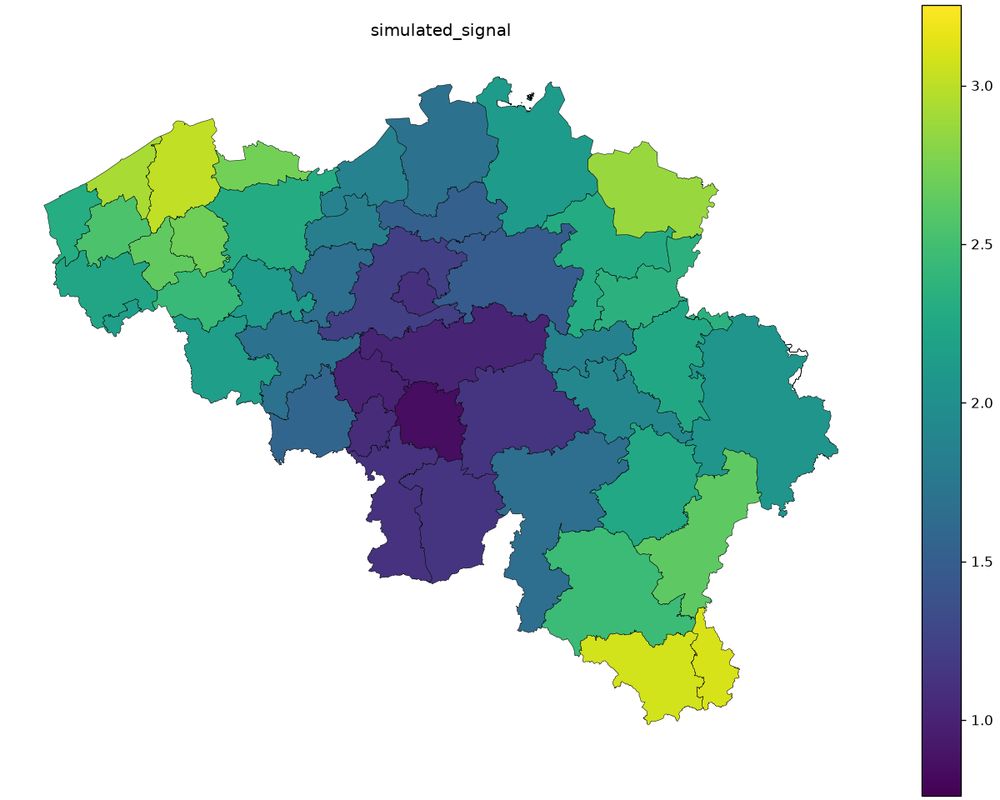
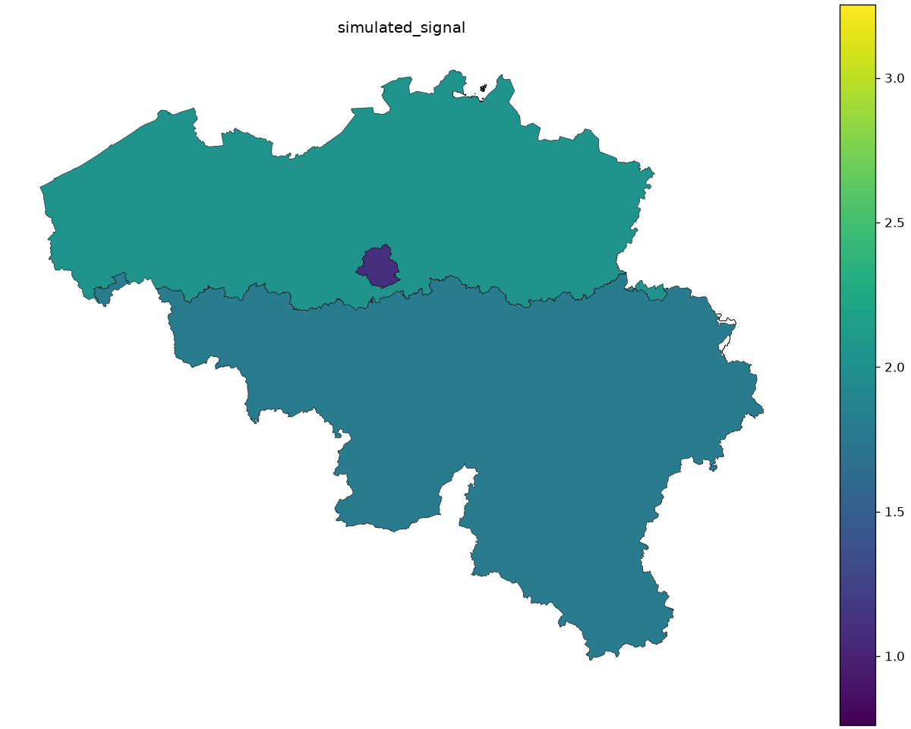

# Belgium: changing geographic scale

The same original records produce different visible patterns at municipality,
arrondissement and region scale. The following maps use one continuous color
range across all three levels, so color changes reflect aggregation.
Arrondissements group municipalities; the three regions are Brussels-Capital,
Flanders and Wallonia.

[](../assets/geographic/aggregation_mun_id.png)

[](../assets/geographic/aggregation_arr_id.png)

[](../assets/geographic/aggregation_reg_id.png)

Look for local peaks disappearing within broader averages. At region scale, only
three means remain; this cannot establish that all residents or records inside
a region have the same value. Changing boundaries changes the question answered
by a map, even when its input records and color limits stay fixed.

## Assignment, aggregation and dissolution

Use the explicit Statbel `mun_id → arr_id` and `mun_id → reg_id` mappings.
`assign_parent` validates the mapping and labels original records. Reaggregate
those records with their original exposure weights. Separately, GeoPandas
`dissolve` merges polygon geometry by the same parent ID. It does not calculate
the statistical summary used here.

Never take an unweighted average of municipality means: municipalities have
unequal record counts and exposure. A parent mean is the original weighted
numerator divided by the original weight total. Parent rates likewise require
original observed and expected totals and exposure; ratios cannot be averaged.
The [numerical checker](index.md#numerical-checks) verifies both from raw records.

## Canonical code

```python
--8<-- "examples/geographic_gallery.py:aggregation"
```

`export` uses native Matplotlib `set_clim` for the pooled limits, and the same
limits for interactive polygons. It exports `aggregation_mun_id.csv`,
`aggregation_arr_id.csv` and `aggregation_reg_id.csv`, each with total weight
and count. The source records are the same simulation as the Belgian means case.

## Data

The bundle contains 581 municipality polygons derived from Statbel's 19,795
statistical sectors for 2024, retaining EPSG:31370 (Belgian Lambert 1972), names
and authoritative mappings to 43 arrondissements and three regions. Statbel
states that the underlying municipality boundaries date to **2022**. These are
historical boundaries; later municipal mergers are outside this snapshot.

Source: [Statbel statistical sectors 2024](https://statbel.fgov.be/en/open-data/statistical-sectors-2024).
Attribution: Statistics Belgium; municipality dissolution by the Geomapviz
documentation contributors. The bundle includes Statbel's redistribution licence,
retrieval date (6 October 2026), SHA-256 checksums, field mappings and preprocessing
instructions in `data/README.md` and `data/manifest.json`.
**All Belgian values and predictions here are simulated.**

## Explore interactively

[Open the full-page map](../assets/geographic/aggregation_reg_id.html) ·
<a href="../assets/geographic/aggregation_reg_id.html" download>Download standalone HTML (5 MB)</a>.
Use hover for the ID, value and support; use the toolbar to pan, zoom and reset.
The PNG above remains available without loading the interactive view.

<details ontoggle="if (this.open) { const frame = this.querySelector('iframe'); if (!frame.hasAttribute('src')) frame.src = frame.dataset.src; }">
<summary>Open the interactive map (5 MB)</summary>
<iframe data-src="../assets/geographic/aggregation_reg_id.html" title="Interactive Belgian region map of a simulated weighted mean" width="100%" height="800" loading="lazy"></iframe>
</details>

## Reproduce

[Download the bundle](../downloads/geographic-examples.zip), extract it, and run
from its directory. [uv](https://docs.astral.sh/uv/guides/scripts/) supplies Python
and dependencies; `--no-project` avoids installing checkout dependencies.

```sh
uv run --no-project --python 3.12 --with 'geomapviz==2.0.1' \
  geographic_gallery.py --case aggregation --output output

uv run --no-project --python 3.12 --with 'geomapviz[interactive]==2.0.1' \
  geographic_gallery.py --case aggregation --interactive --output output
```

The first command exports PNGs, inspectable CSVs and metadata JSON; the second
also exports standalone HTML. Data paths are relative to the script, so running
needs no data downloads, map tiles or Python server. Full geometry makes HTML
exports large and slower to generate.
