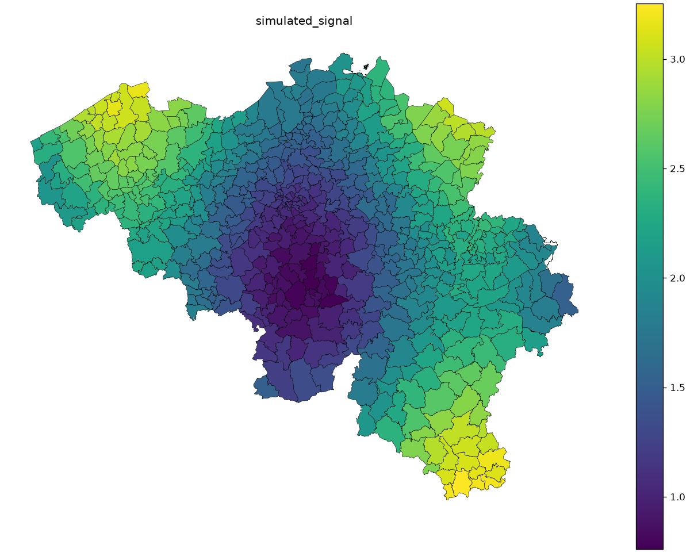
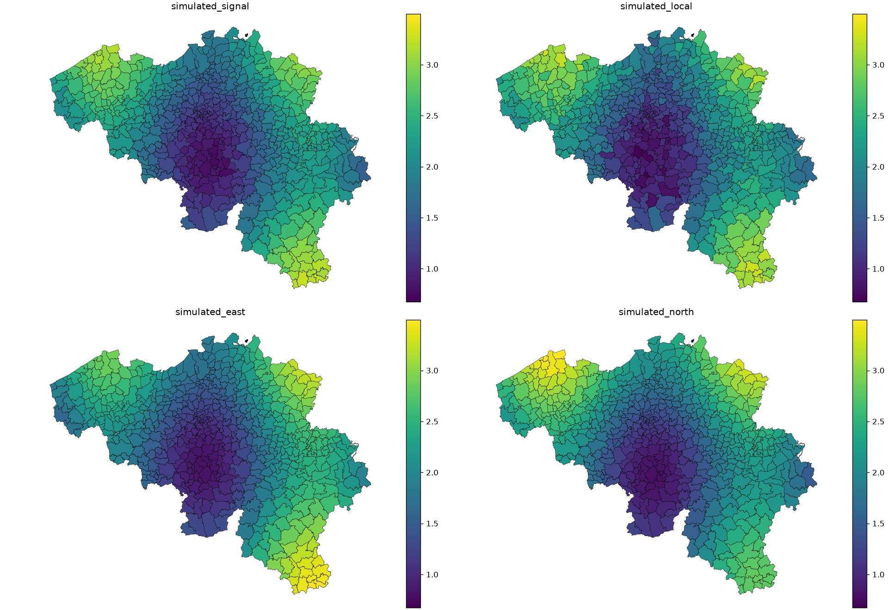
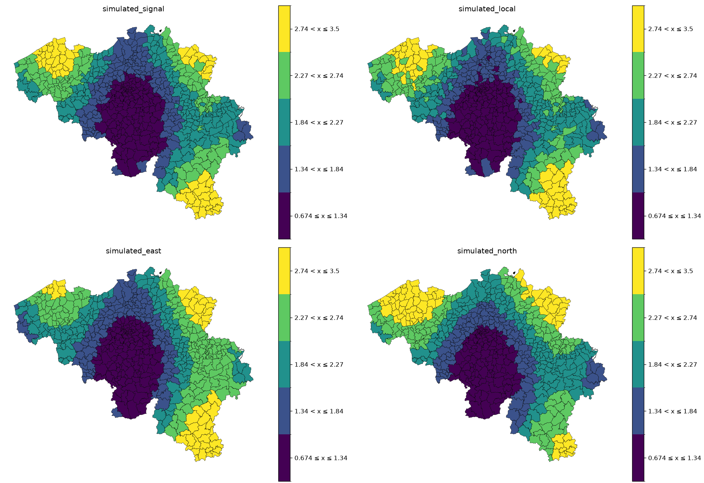

# Belgium: geographic means

A recognizable municipality map makes a spatial mean easier to interpret.
Start with one simulated signal, then compare local noise and directional biases
on the same Belgian geography.

[](../assets/geographic/belgium_mean.png)

Look for broad bands and local variation. Each polygon has one weighted mean;
a large municipality is not automatically more influential. The mean comes from the records and
positive weights; polygon area is not used as a statistical weight.

## Equal and weighted means

An equal mean is `sum(value) / record_count`. An exposure-weighted mean is
`sum(value * exposure) / sum(exposure)`. For example, values 10 and 20 with
weights 1 and 3 give 15 equally weighted and 17.5 weighted. The runner exports
`belgium_equal.csv`, `belgium_weighted.csv` and `belgium_records.csv` so you can
compare these computations for every municipality. `support_count` counts
positive-weight records; `total_weight` sums exposure. Neither is uncertainty.

## Four comparable maps

[](../assets/geographic/belgium_predictors.png)

Read the panels left to right, then top to bottom: `simulated_signal`,
`simulated_local`, `simulated_east`, `simulated_north`. All have the same units
and continuous color range. Local noise mostly washes out when aggregated;
the east and north predictors retain systematic directional errors. Shared
colors let you compare the same value across panels.

## Classification

[](../assets/geographic/belgium_classified.png)

The classified panels pool their finite values into five Fisher–Jenks classes.
The interval edges and palette are shared across panels and rendering backends.
Classification emphasizes areas crossing an edge and hides small differences
inside each interval. Read the interval labels rather than interpreting colors
as a continuous measurement.

## Canonical code

This is the actual case function from `geographic_gallery.py`, included at build
time. Download the full runner with its shared loading, simulation and export
helpers; the displayed function is an excerpt, not a separate implementation.

```python
--8<-- "examples/geographic_gallery.py:belgium"
```

The shared generator uses centroids in the projected boundary CRS, never raw
longitude/latitude degrees. It scales east/north coordinates to the country
extent and combines sine/cosine patterns with fixed-seed noise. Each area has
5–15 records and strictly positive exposure sampled between 0.2 and 3. These
weights and signals are teaching data, without a physical unit or fitted model.

```python
--8<-- "examples/geographic_gallery.py:simulation"
```

## Data

The bundle contains 581 municipality polygons derived from Statbel's 19,795
statistical sectors for 2024, retaining EPSG:31370 (Belgian Lambert 1972), names
and authoritative mappings to 43 arrondissements and three regions. Statbel
states that the underlying municipality boundaries date to **2022**. These are
historical boundaries; later municipal mergers are outside this snapshot.

Source: [Statbel statistical sectors 2024](https://statbel.fgov.be/en/open-data/statistical-sectors-2024).
Attribution: Statistics Belgium; municipality dissolution by the Geomapviz
documentation contributors. The bundle includes Statbel's redistribution licence,
retrieval date (6 October 2026), SHA-256 checksums, field mappings and preprocessing
instructions in `data/README.md` and `data/manifest.json`.
**All Belgian values and predictions here are simulated.**

## Explore interactively

[Open the full-page map](../assets/geographic/belgium_mean.html) ·
<a href="../assets/geographic/belgium_mean.html" download>Download standalone HTML (25 MB)</a>.
Use hover for the ID, value and support; use the toolbar to pan, zoom and reset.
The PNG above remains available without loading the interactive view.

<details ontoggle="if (this.open) { const frame = this.querySelector('iframe'); if (!frame.hasAttribute('src')) frame.src = frame.dataset.src; }">
<summary>Open the interactive map (25 MB)</summary>
<iframe data-src="../assets/geographic/belgium_mean.html" title="Interactive Belgian municipality map of a simulated weighted mean" width="100%" height="800" loading="lazy"></iframe>
</details>

## Reproduce

[Download the bundle](../downloads/geographic-examples.zip), extract it, and run
from its directory. [uv](https://docs.astral.sh/uv/guides/scripts/) supplies Python
and dependencies; `--no-project` avoids installing checkout dependencies.

```sh
uv run --no-project --python 3.12 --with 'geomapviz==2.0.0' \
  geographic_gallery.py --case belgium --output output

uv run --no-project --python 3.12 --with 'geomapviz[interactive]==2.0.0' \
  geographic_gallery.py --case belgium --interactive --output output
```

The first command exports PNGs, inspectable CSVs and metadata JSON; the second
also exports standalone HTML. Data paths are relative to the script, so running
needs no data downloads, map tiles or Python server. Full geometry makes HTML
exports large and slower to generate. These commands use the currently published
2.0.0 package; the bundle also documents the upcoming 2.0.1 documentation patch,
which uses the same APIs.
