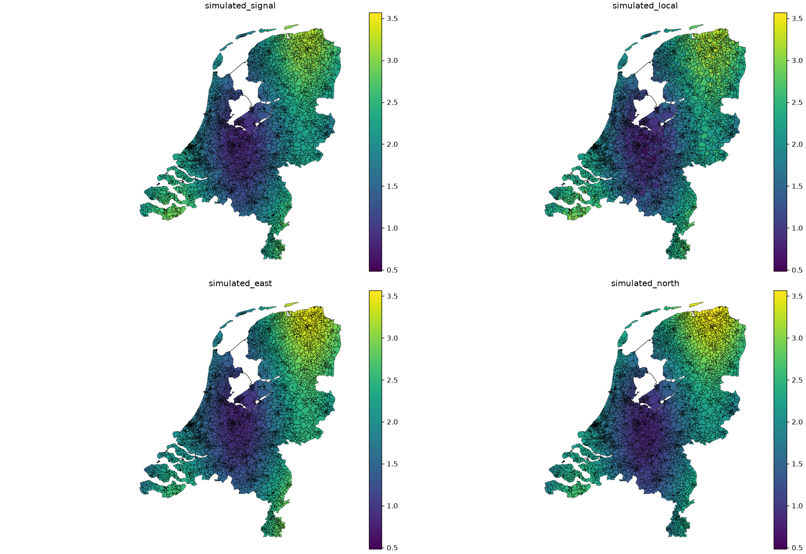
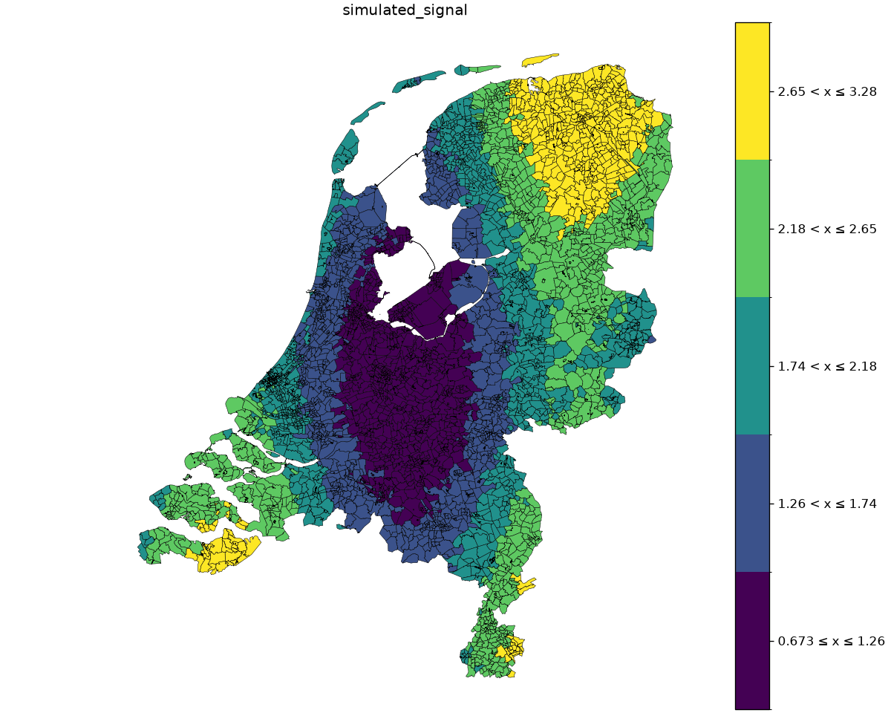

# Netherlands: postcode geography

Real four-digit postcode polygons reveal spatial patterns that rectangles cannot.
These countrywide maps recreate the spatial-pattern workflow from the archived
1.1.3 examples using the current v2 API. Values and predictors are **simulated**.

## Continuous patterns

[](../assets/geographic/netherlands_continuous.png)

The four panels show the simulated signal, local variation, east bias and north
bias on a common scale. Notice how small postcode areas cluster in cities while
rural polygons cover more space. Polygon size is not population or support.

The shared generator uses centroids in the projected boundary CRS, never raw
longitude/latitude degrees. It scales east/north coordinates to the country
extent and combines sine/cosine patterns with fixed-seed noise. Each area has
5–15 records and strictly positive exposure sampled between 0.2 and 3. These
weights and signals are teaching data, without a physical unit or fitted model.

## Classified patterns

[](../assets/geographic/netherlands_classified.png)

Five Fisher–Jenks intervals summarize the signal. Compare the class boundaries
with the continuous panel: nearby values may receive different colors when they
cross an edge. Static and interactive exports use the same classification rules.
This single-panel view is also easier to explore at small-area scale.

## Canonical code

```python
--8<-- "examples/geographic_gallery.py:netherlands"
```

`load_boundaries` uses GeoPandas on the complete local ZIP. The postcode IDs are
strings, not numeric measurements. `netherlands_records.csv` contains the
simulated input; `netherlands.csv` contains weighted means, counts and exposure;
`netherlands.json` preserves CRS and coverage metadata separately from CSV.

## Data

The snapshot freezes the CBS postcode4 collection published through
[PDOK](https://api.pdok.nl/cbs/postcode4/ogc/v1?f=html&lang=en), filtered to
`jaarcode=2024`. All 4,071 postcode polygons retain full geometry in
**EPSG:28992 (RD New)** and text identifiers. This historical postcode geography
is not a current postal delivery lookup.

Attribution: **CBS / PDOK, postcode4 statistics 2024**, retrieved 6 October 2026;
converted to shapefile by the Geomapviz documentation contributors. Licensed
under [CC BY 4.0](https://creativecommons.org/licenses/by/4.0/). Source URLs,
checksums, field mappings, licence text and preprocessing instructions accompany
the data in the [bundle](../downloads/geographic-examples.zip).

## Explore interactively

[Open the full-page map](../assets/geographic/netherlands_classified.html) ·
<a href="../assets/geographic/netherlands_classified.html" download>Download standalone HTML (21 MB)</a>.
Use hover for the ID, value and support; use the toolbar to pan, zoom and reset.
The PNG above remains available without loading the interactive view.

<details ontoggle="if (this.open) { const frame = this.querySelector('iframe'); if (!frame.hasAttribute('src')) frame.src = frame.dataset.src; }">
<summary>Open the interactive map (21 MB)</summary>
<iframe data-src="../assets/geographic/netherlands_classified.html" title="Interactive classified simulated signal on Dutch four-digit postcode polygons" width="100%" height="800" loading="lazy"></iframe>
</details>

## Reproduce

[Download the bundle](../downloads/geographic-examples.zip), extract it, and run
from its directory. [uv](https://docs.astral.sh/uv/guides/scripts/) supplies Python
and dependencies; `--no-project` avoids installing checkout dependencies.

```sh
uv run --no-project --python 3.12 --with 'geomapviz==2.0.1' \
  geographic_gallery.py --case netherlands --output output

uv run --no-project --python 3.12 --with 'geomapviz[interactive]==2.0.1' \
  geographic_gallery.py --case netherlands --interactive --output output
```

The first command exports PNGs, inspectable CSVs and metadata JSON; the second
also exports standalone HTML. Data paths are relative to the script, so running
needs no data downloads, map tiles or Python server. Full geometry makes HTML
exports large and slower to generate.
