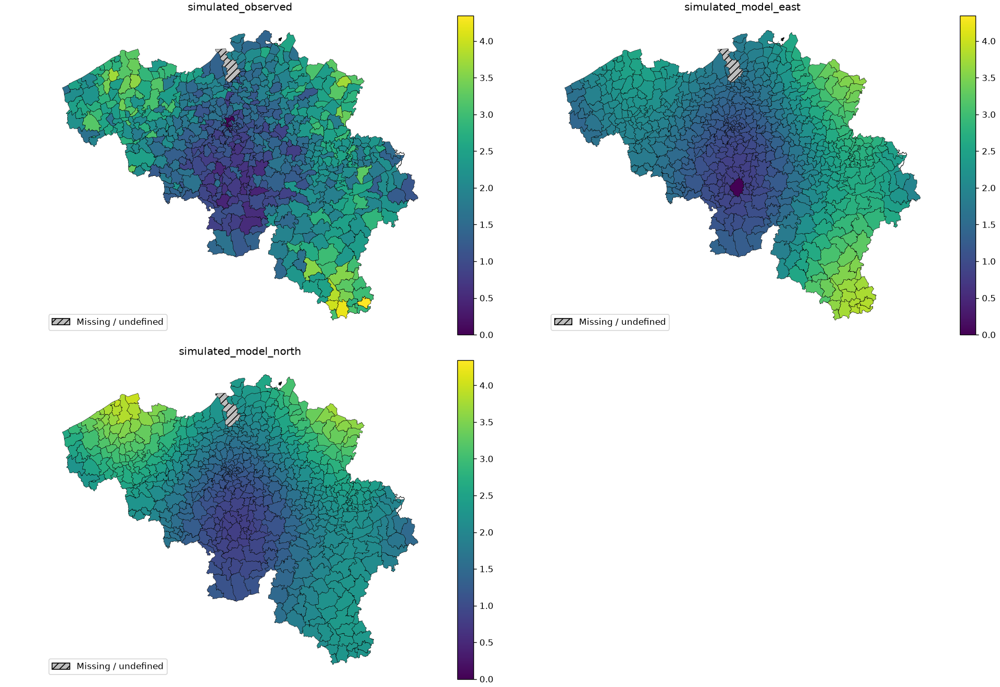
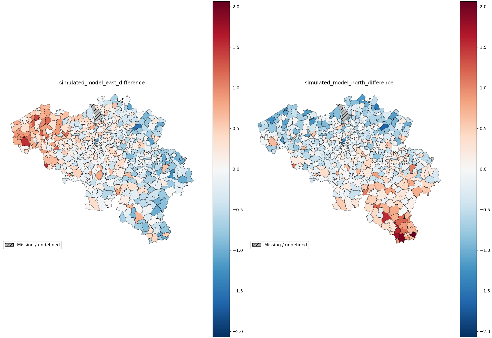
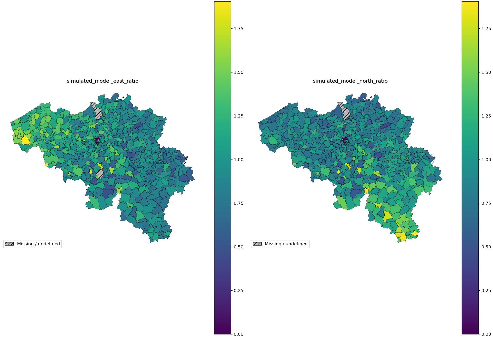
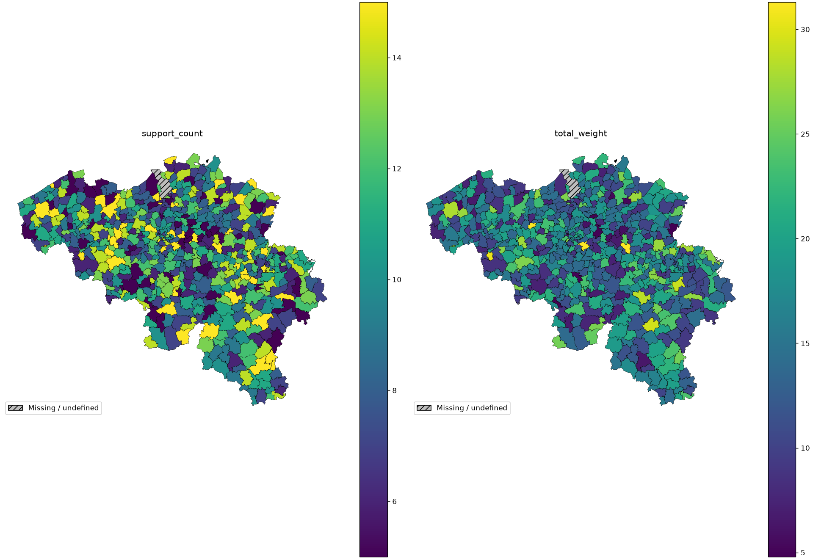
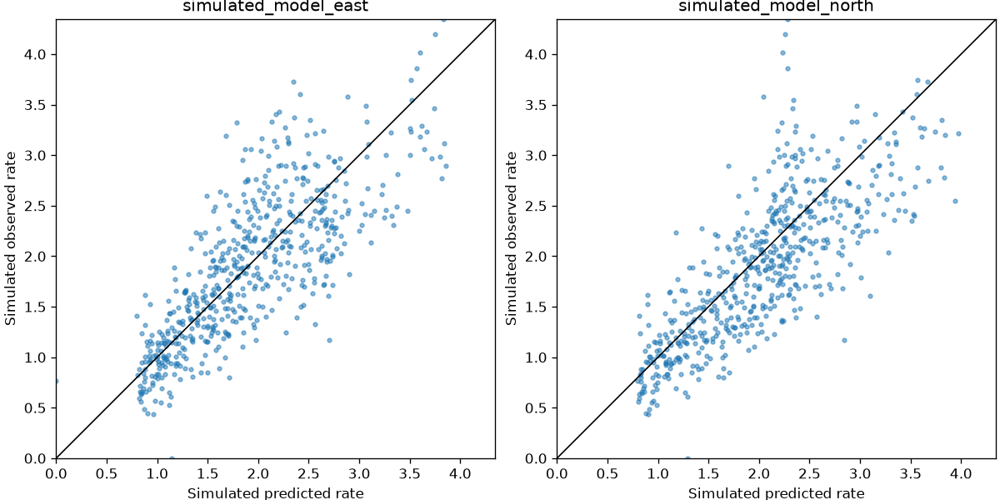

# Belgium: observed and predicted rates

These observations and two predictions are **simulated**, using real municipality
boundaries. Observations are Poisson counts generated from a geographic signal
and positive exposure. The predictions are rates with deliberately different
east and north errors; neither is a fitted or validated model.

## Compare rates on one scale

[](../assets/geographic/rates_shared.png)

The east predictor is below the latent rate in the west and above it in the
east; the north predictor has the equivalent south/north bias. Poisson sampling
adds observation noise. A municipality's observed rate is
`sum(observed_count) / sum(exposure)`; its predicted rate is
`sum(predicted_rate * exposure) / sum(exposure)`. Observed counts are summed
once, not multiplied by exposure again.

## Signed errors and ratios

[](../assets/geographic/rates_difference.png)

A positive difference means underprediction; a negative one means overprediction.
Both models share a symmetric diverging scale centered on zero. The directional
errors are easier to see here than in the original rate maps.

[](../assets/geographic/rates_ratio.png)

Ratios use `observed_total / expected_total`, where the expected total is
`sum(predicted_rate * exposure)`. One means equal totals; values above one mean
underprediction. The ratio maps share their own scale, distinct from differences
and rates. A small predicted denominator can magnify a ratio.

Three deliberate cases preserve different meanings:

| Municipality | Meaning |
| --- | --- |
| Antwerpen, `11002` | No observations: boundary remains visible with missing metrics and support |
| Bruxelles/Brussel, `21004` | Genuine observed zero with positive exposure: rate is zero |
| Charleroi, `52011` | East prediction is zero: its observed/expected ratio is undefined, while a difference remains defined |

Grey/hatched areas represent missing or undefined values, never a measured zero.
Inspect `rates.csv` and coverage in `rates.json` to distinguish the reasons.

## Support and scatterplot

[](../assets/geographic/rates_support.png)

Counts and exposure show how much input supports each estimate. They do not
provide confidence intervals, prediction intervals or a model of uncertainty.

[](../assets/geographic/rates_scatter.png)

Each dot is one municipality, equally sized. The line marks perfect equality.
The scatterplot summarizes agreement but loses spatial arrangement: similarly
shaped clouds can conceal different directional errors. Use it alongside maps.

## Canonical code

```python
--8<-- "examples/geographic_gallery.py:rates"
```

The shared generator uses centroids in the projected boundary CRS, never raw
longitude/latitude degrees. It scales east/north coordinates to the country
extent and combines sine/cosine patterns with fixed-seed noise. Each area has
5–15 records and strictly positive exposure sampled between 0.2 and 3. These
weights and signals are teaching data, without a physical unit or fitted model.

## Data

The bundle contains 581 municipality polygons derived from Statbel's 19,795
statistical sectors for 2024, retaining EPSG:31370 (Belgian Lambert 1972), names
and authoritative mappings to 43 arrondissements and three regions. Statbel
states that the underlying municipality boundaries date to **2022**. These are
historical boundaries; later municipal mergers are outside this snapshot.

Source: [Statbel statistical sectors 2024](https://statbel.fgov.be/en/open-data/statistical-sectors-2024).
Attribution: Statistics Belgium; municipality dissolution by the Geomapviz
documentation contributors. The bundle includes Statbel's redistribution licence,
retrieval date (6 October 2026), SHA-256 checksums, field mappings and preprocessing
instructions in `data/README.md` and `data/manifest.json`.
**All Belgian values and predictions here are simulated.**

## Explore interactively

[Open the full-page map](../assets/geographic/rates_ratio.html) ·
<a href="../assets/geographic/rates_ratio.html" download>Download standalone HTML (46 MB)</a>.
Use hover for the ID, value and support; use the toolbar to pan, zoom and reset.
The PNG above remains available without loading the interactive view.

<details ontoggle="if (this.open) { const frame = this.querySelector('iframe'); if (!frame.hasAttribute('src')) frame.src = frame.dataset.src; }">
<summary>Open the interactive map (46 MB)</summary>
<iframe data-src="../assets/geographic/rates_ratio.html" title="Interactive observed-to-expected ratios for two simulated Belgian rate predictors" width="100%" height="500" loading="lazy"></iframe>
</details>

## Reproduce

[Download the bundle](../downloads/geographic-examples.zip), extract it, and run
from its directory. [uv](https://docs.astral.sh/uv/guides/scripts/) supplies Python
and dependencies; `--no-project` avoids installing checkout dependencies.

```sh
uv run --no-project --python 3.12 --with 'geomapviz==2.0.0' \
  geographic_gallery.py --case rates --output output

uv run --no-project --python 3.12 --with 'geomapviz[interactive]==2.0.0' \
  geographic_gallery.py --case rates --interactive --output output
```

The first command exports PNGs, inspectable CSVs and metadata JSON; the second
also exports standalone HTML. Data paths are relative to the script, so running
needs no data downloads, map tiles or Python server. Full geometry makes HTML
exports large and slower to generate. These commands use the currently published
2.0.0 package; the bundle also documents the upcoming 2.0.1 documentation patch,
which uses the same APIs.
