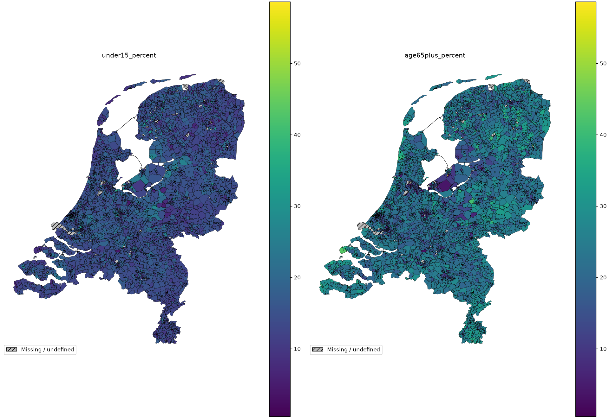

# Geomapviz

Geomapviz helps Python data analysts summarize records by area and map averages
or actual-versus-predicted rates on their own geographic boundaries.

## TL;DR

- Calculate averages by area, with optional weights.
- Group smaller areas into larger districts or regions using your area mapping.
- Match results to your own map boundaries.
- Compare actual and predicted rates, including differences and ratios.
- Automatically group values into color ranges, shared across comparable maps shown together.
- Create static images or interactive HTML maps, and inspect the underlying pandas tables.

## When is it useful?

| Situation | How Geomapviz helps |
| --- | --- |
| Your table contains many records for each town or postcode. | [Summarize them into one result per area](examples/belgium.md). Use weights when records represent different populations or amounts of activity. |
| You need both local detail and a regional overview. | [Group geographic IDs using your area mapping](examples/aggregation.md) and recalculate results from the original records. |
| You want to find where predictions are too high or too low. | [Compare actual and predicted rates](examples/rates.md) on matching scales, then map their differences and ratios. |
| Small color differences make a map difficult to read. | [Use automatic bins](examples/belgium.md#classification) to show values in a few color ranges, shared across comparable maps shown together. |

**Aggregation** means summarizing rows by area. **Geographic IDs** are the codes
identifying those areas, such as town codes or postcodes; they connect your
records to your boundaries.

To move from towns → districts → regions, supply a mapping of smaller-area IDs
to larger-area IDs. Geomapviz assigns those IDs with `assign_parent`; then use
`aggregate_means` or `aggregate_rates` to recalculate summaries from the original
records and weights. GeoPandas merges the boundaries with `dissolve`.

**Autobinning** chooses numerical color ranges automatically, so nearby values
can share a color. Enable it with `autobin=True` and set the maximum number of
ranges with `n_bins`; the [illustrated example](examples/belgium.md#classification)
shows five ranges.

Calculate a summary once, inspect its pandas table, and reuse it for static or
interactive maps. Comparable maps shown together share colors for the same
values; rates, differences and ratios use separate scales. Areas without data
remain visible as missing, distinct from measured zero.

## Try the Belgian example

[](examples/belgium.md)

This map uses real Belgian municipality boundaries and **simulated values**.

Download and extract the [geographic examples](downloads/geographic-examples.zip),
then run this working Belgian demonstration from the extracted directory:

```sh
uv run --no-project --python 3.12 --with 'geomapviz==2.0.2' \
  geographic_gallery.py --case belgium --output output
```

Open `output/belgium_mean.png`. No data downloads, tiles or Python server are
needed when running the script. [The walkthrough](examples/belgium.md) explains
the signal, weighting and four comparable maps.

## Installation

[uv](https://docs.astral.sh/uv/getting-started/installation/) supplies Python and
dependencies for the command above. `--no-project` avoids installing a surrounding
checkout's dependencies. For an existing Python 3.12+ environment:

```sh
python -m pip install geomapviz==2.0.2
# For interactive maps and standalone HTML:
python -m pip install 'geomapviz[interactive]==2.0.2'
```

See the [Quickstart](quickstart.md#installation) for environment setup and platforms.

## Explore geographic examples

[](examples/demographics.md)

Compare [Belgian means](examples/belgium.md),
[changing administrative scale](examples/aggregation.md) and
[observed versus predicted rates](examples/rates.md). Explore
[Dutch postcode patterns](examples/netherlands.md) and
[measured CBS population counts](examples/demographics.md).
Each tutorial includes results, source code, data notes and a reproduction command.

Start with the [Quickstart](quickstart.md), or consult the
[guides](aggregation.md) and [API and migration](api.md).
The archived [1.1.3 tutorials](https://geomapviz.readthedocs.io/en/1.1.3/nb/geomap.html)
and [2.0.0 documentation](https://geomapviz.readthedocs.io/en/v2.0.0/)
remain available. Large geographic data files are in the separate examples
bundle, outside package installations.
